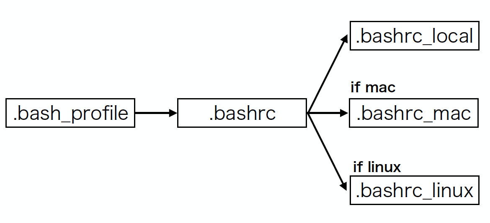
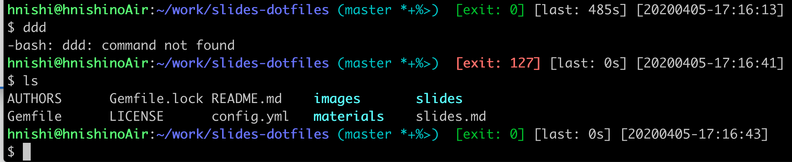

# dotfiles

Date: 2020-04-15
Speaker: Hiroshi Nishigami (hnishi)

---

## 近況

[HHKB (Happy Hacking Keyboard)](https://www.pfu.fujitsu.com/direct/hhkb/detail_pd-kb800bs.html)
を買いました。 :money_with_wings:


---

## はじめに

最近（去年１２月頃⛄️）、 [自分の dotfiles を整理した](https://qiita.com/hnishi/items/28ad11df1dde8b0ed368) ため、共有しようと思いました。
（+ 3 ヶ月くらい使ってみて、ちょっとだけノウハウがたまったので）

---

## 対象

ターミナル (CLI) 初学者向けかもしれません。

---

## dotfiles とは

- unix-like systems における設定ファイルのこと。
- ファイル名がドット . から始まることに由来。

---

## dotfiles の例

- .bash_profile
- .bashrc
- .zshrc
- .asdfrc
- .gitconfig
- .vimrc

---

## Catalina からデフォルトシェルが bash 👉 zsh に変わった

- Mojave では Bash 3.2 (GNU Bash) (2007年から)
- なお、bash の開発は active で現在 version 5.0
- 新しい bash のライセンスは GPLv3
- GPLv3 の制限が厳しい（独自ソフトでの使用禁止、特許絡みの問題）
- ちなみに、zsh は MIT License

https://thenextweb.com/dd/2019/06/04/why-does-macos-catalina-use-zsh-instead-of-bash-licensing/

---

## dotfiles の何を話すのか

TODO: メリットについて話す

「環境構築で消耗していませんか？」

---

## 管理手法が非常に多岐にわたっている

ちょっと検索しただけでも、プログラマーごとに色が出過ぎている。

---

## たとえば

- [ホームディレクトリをまるごと git で管理する方法](https://medium.com/toutsbrasil/how-to-manage-your-dotfiles-with-git-f7aeed8adf8b)
- [make](https://qiita.com/b4b4r07/items/b70178e021bef12cd4a2)
- [ruby](https://medium.com/@webprolific/getting-started-with-dotfiles-43c3602fd789)
- [python](https://pypi.org/project/dotfiles/)

---

## 私の dotfiles 戦略

- 最小構成のサーバーに対しても、すぐにdotfilesを展開できる
- Mac, Linux, Windows (mintty) に対応

---

## 方針

- できるだけシンプルな構成にする
- bash 依存のみ

---

## 成果物

https://github.com/hnishi/dotfiles

---

## 工夫

ワンラインのコマンド一発で、ダウンロードとインストールを行えるようにしました

---

## ベース

[bash だけで展開できる最小構成の dotfiles レポジトリ](https://github.com/yutakatay/dotfiles-mini) を参考にさせてもらいました。

---

## 使い方

```
curl -L raw.githubusercontent.com/hnishi/dotfiles/master/scripts/download.sh | bash
```

[code](https://github.com/hnishi/dotfiles/blob/master/scripts/download.sh)

---

## git がある場合

```bash
    if is_exists "git"; then
    # --recursive equals to ...
    # git submodule init
    # git submodule update
    git clone --recursive "$DOTFILES_GITHUB" "$DOTPATH"
```

---

## curl がある場合

```
    elif is_exists "curl" || is_exists "wget"; then
    # curl or wget
    local tarball="https://github.com/hnishi/dotfiles/archive/master.tar.gz"
    if is_exists "curl"; then
    curl -L "$tarball"
```

---

## wget がある場合

```bash
    elif is_exists "wget"; then
    wget -O - "$tarball"

    fi | tar xvz
    if [ ! -d dotfiles-master ]; then
    log_fail "dotfiles-master: not found"
    exit 1
    fi
    command mv -f dotfiles-master "$DOTPATH"
```

---

## dotfiles をインストールする仕組み

レポジトリに存在する . (ドット) から始まるファイル or ディレクトリに関して、
既存ファイルのバックアップを取って、ホームディレクトリにシンボリックリンクを貼る

---

```bash
    if [[ "$HOME" != "$dotdir" ]];then
    for f in $dotdir/.??*; do
      [[ `basename $f` == ".git" ]] && continue
      if [[ -L "$HOME/`basename $f`" ]];then
        command rm -f "$HOME/`basename $f`"
      fi
      if [[ -e "$HOME/`basename $f`" ]];then
        command mv --backup=numbered "$HOME/`basename $f`" "$HOME/.gdotbackup"
      fi
      command ln -snf $f $HOME
    done
```

[code](https://github.com/hnishi/dotfiles/blob/50e37693a3f12dc2ff5e6f50257bd9ce75f6eabd/scripts/install.sh#L23-L33)

---

### TIPS

mv の --backup=numbered オプションをつければ、番号を振ってバックアップしてくれます。
私は最近知りました。

---

## マルチプラットフォーム対応

```bash
$ ls -a ~/.bashrc*
/Users/hnishi/.bashrc
/Users/hnishi/.bashrc_local
/Users/hnishi/.bashrc_linux
/Users/hnishi/.bashrc_mac
```

---

## bash 設定の読み込みの流れ



---

## .bash_profile と .bashrc の違い

TODO: magicant さんの記事を引用する

---

## プロンプトのカスタマイズ

- あまりイケてない
- exit status による色付け、実行時間、現在時刻など



---

## プロンプトのカスタマイズ

bash だと PROMPT_COMMAND に関数を指定すると、プロンプト表示時に実行される。

```bash
dispatch () {
  local EXIT_STATUS="$?" # 直前のコマンド実行結果のエラーコードを保存
  timer_stop # 直前のコマンドの処理時間を図るためのタイマー(関数)
  get_datetime # 現在時刻を取得する関数

  local status_color="" # exit status によって色を変える
  if [ $EXIT_STATUS != 0 ]; then
    status_color=$PALE_RED
  else
    status_color=$DARK_GREEN
  fi
  export PS1="${GREEN}${PS1_USER}${WHITE}:${PALE_BLUE}\w${CYAN}$(__git_ps1) ${status_color} [exit: \$?] ${WHITE}[last: ${timer_show}s] [${prompt_datetime}]\n\$ "
}
export PROMPT_COMMAND=dispatch
```

[code](https://github.com/hnishi/dotfiles/blob/50e37693a3f12dc2ff5e6f50257bd9ce75f6eabd/.bashrc#L131-L155)

---

## 結果

bash + {git,curl,wget}
があれば即座にインストールできます

---

## bash だけでも TCP 通信ができるらしい

もしかすると、curl も使わなくてもいいのかもしれませんが、これは試してないです。

```bash
exec 3<>/dev/tcp/www.google.com/80
echo -e "GET / HTTP/1.1\r\nhost: http://www.google.com\r\nConnection: close\r\n\r\n" >&3
cat <&3
```

https://www.linuxjournal.com/content/more-using-bashs-built-devtcp-file-tcpip

---

## 使いやすいように template を作成しました

以下にあるコードをコピーすると、レポジトリに dotfiles を配置するだけで使えます
(bashのみ対応)。

https://github.com/hnishi/dotfiles/releases/tag/minimal-template-v0

---

## まとめ

- dotfiles は育てていく感覚があって楽しい 😃

---

# おまけ

---

## VS Code

(PC ごとの path 等が設定ファイルに入ってくるので結構面倒)

[Visual Studio Code が公式の設定ファイル同期ツールを発表](https://code.visualstudio.com/updates/v1_43#_settings-sync)
(現在 preview 版のみ)

まだ使ったことはないですが、期待。
マイクロソフトアカウントへの sign in が必要みたい。

https://code.visualstudio.com/docs/editor/settings-sync

---

## おすすめの Theme

簡単に、プロンプトを設定

- [starship](https://github.com/starship/starship)
  - bash fish, zsh, powershell, Ion に対応
- [powerlevel10k](https://github.com/romkatv/powerlevel10k)
  - zsh のみ対応

---

## starship

<video src="https://starship.rs/demo.webm" width="80%"></video>

https://starship.rs/

---

## powerlevel10k


https://github.com/romkatv/powerlevel10k

---

TODO: https://qiita.com/yutakatay/items/c6c7584d9795799ee164#%E4%BB%8A%E3%81%99%E3%81%90%E3%81%AB%E3%81%A7%E3%82%82%E5%A7%8B%E3%82%81%E3%82%89%E3%82%8C%E3%82%8B%E6%9C%80%E5%B0%8Fdotfiles%E3%81%AE%E4%BD%9C%E3%82%8A%E6%96%B9 読んで内容をすこし引用する
